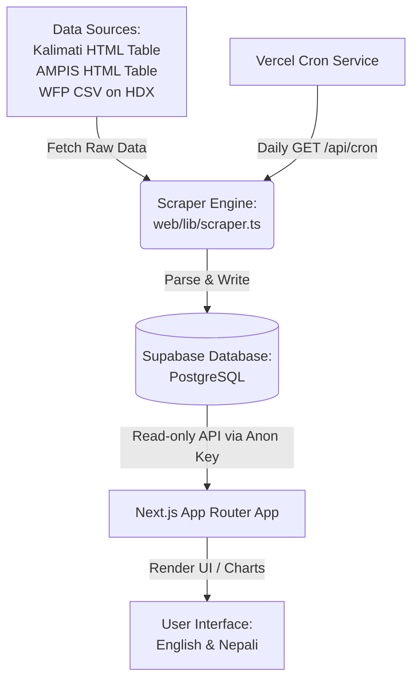

# Krishi Mulya (कृषि मूल्य)

> Nepal Agriculture Price Intelligence & Monitoring System

**Krishi Mulya (कृषि मूल्य)** is a Nepalese agricultural price intelligence and monitoring web platform. It automatically tracks daily wholesale rates from the Kalimati Fruits & Vegetable Market Development Board and regional government AMPIS feeds, alongside monthly retail staple indices from the World Food Programme (WFP/HDX datasets). It displays them in searchable tables, trend analysis charts, and supports interest signup for notifications.

Designed for Nepalese farmers, agricultural cooperatives, traders, and agri-businesses, Krishi Mulya resolves severe market price asymmetry through unified data access.

---

## 📸 Screenshots / Demo

| Dashboard Home | Commodity Trends | Historical Charts |
|:---:|:---:|:---:|
| *[Add `homepage.png` here]* | *[Add `commodity_details.png` here]* | *[Add `price_chart.png` here]* |

*Note: Please save your screenshots in the `web/public/screenshots/` directory and update the links above accordingly.*

---

## ✨ Features

- **✓ Search & Filters**: Instant search across 98+ commodities with categorization (Vegetables, Fruits, Staples, Spices, Root Vegetables, etc.).
- **✓ Historical Trends**: High-performance interactive charts (using Recharts) to analyze price fluctuations over customizable daily/monthly periods.
- **✓ Data Confidence Indicator**: Custom PostgreSQL views analyze prices from multiple sources to show data confidence ratings (*High (Consensus)*, *Medium*, *Low (Discrepancy)*).
- **✓ Multilingual (i18n)**: Native support for English and Nepali interfaces with automatic Gregorian (AD) ↔ Bikram Sambat (BS) date conversion.
- **✓ CLI Seeders & Utilities**: Quick setup tools to sync master names, backfill historical WFP retail data, and manually trigger scraping cycles.

---

## 💡 Problem Statement & Purpose

Nepalese farmers, agricultural cooperatives, and local traders face high **market price asymmetry**. Wholesale and retail commodity prices fluctuate daily, but official data is spread across different websites, structured in hard-to-read HTML tables, or tucked away in monthly CSV databases. 

### Why Existing Solutions Are Insufficient:
1. **Inaccessible Layouts**: Government sites (like Kalimati Board or AMPIS) are not mobile-responsive, making them hard to use in fields.
2. **No Historical Comparison**: Raw daily tables are ephemeral; they do not allow users to check historical archives or search past trends.
3. **Siloed Data**: Daily wholesale pricing is separated from monthly retail food baskets (WFP), making it difficult to analyze margins.

### How Krishi Mulya Solves It:
Krishi Mulya aggregates raw data into a unified, serverless database, standardizes names into mapped commodities, and translates Nepali/English terminology. The system serves as a clean, responsive, and historical ledger of Nepal's agrarian market health.

---

## 🛠️ Tech Stack

### Frontend
- **Framework**: Next.js 16 (App Router)
- **Language**: TypeScript
- **Styling**: Vanilla CSS & Tailwind CSS 4
- **Charts**: Recharts (Responsive Line & Bar Charts)
- **Date Conversion**: `nepali-date-converter`

### Backend
- **Data Ingestion**: Serverless Route Handlers (`/api/cron`)
- **Web Scraping**: Axios & Cheerio

### Database & Security
- **Database**: Supabase (PostgreSQL)
- **Access Control**: Row-Level Security (RLS) with Anonymous Read Policies
- **Database Views**: Custom aggregation & lag window calculations for price trends

### Hosting & Infrastructure
- **Web Application**: Vercel (Hobby Tier)
- **Scheduler**: Vercel Cron

---

## 🏗️ Architecture Overview

The serverless data pipeline works as follows:



---

## 🚀 Installation & Setup

### Prerequisites
- **Node.js**: v20 or later
- **pnpm**: v9 or later (recommended)
- **Git**
- **Supabase Account**: A free project database

### Step 1: Clone the Repository
```bash
git clone https://github.com/Siz09/Krishi_Mulya.git
cd Krishi_Mulya
```

### Step 2: Database Initialization
1. In your **Supabase Dashboard**, navigate to **SQL Editor** -> **New Query**.
2. Copy and paste the contents of [supabase/schema.sql](file:///d:/vscode/KrishiMulya/supabase/schema.sql) and click **Run**.
3. Sequentially copy and run any incremental SQL files inside [supabase/migrations/](file:///d:/vscode/KrishiMulya/supabase/migrations/).

### Step 3: Environment Setup
Copy the environment variables template to the `web` directory:
```bash
cp .env.example web/.env.local
```
Open `web/.env.local` and populate it with your Supabase credentials:
```env
NEXT_PUBLIC_SUPABASE_URL=https://your-project-id.supabase.co
NEXT_PUBLIC_SUPABASE_ANON_KEY=your-anon-public-key
SUPABASE_URL=https://your-project-id.supabase.co
SUPABASE_SERVICE_ROLE_KEY=your-service-role-secret-key
CRON_SECRET=your-random-cron-secret-hash
```

### Step 4: Install Dependencies & Run
Go to the `web` workspace and run the development server:
```bash
cd web
pnpm install
pnpm dev
```
Open [http://localhost:3000](http://localhost:3000) in your browser.

---

## ⚙️ Configuration

### Environment Variables

| Variable | Scope | Purpose |
|---|---|---|
| `NEXT_PUBLIC_SUPABASE_URL` | Public / Client | Direct client-side fetching from Supabase |
| `NEXT_PUBLIC_SUPABASE_ANON_KEY` | Public / Client | Public RLS read-only access token |
| `SUPABASE_URL` | Server | Project URL for scraping triggers |
| `SUPABASE_SERVICE_ROLE_KEY` | Server ONLY | Master key (bypasses RLS). **Never share or commit.** |
| `CRON_SECRET` | Server ONLY | Secures the serverless `/api/cron` endpoint |

---

## 📈 Usage

### User Workflow
1. **Open Homepage**: Visit the app and select your language preference (English or Nepali) using the header switcher.
2. **Search & Filter**: Type in the search box to filter commodities by name or toggle categories (e.g. Vegetables).
3. **Analyze Daily Trends**: Click any wholesale commodity row to open its detail page and inspect the 30-day price trend chart.
4. **Browse Staples**: Navigate to the "Staples" tab to view monthly retail food prices sourced from WFP.
5. **Register Alert Interest**: Enter your email address in the interest form to subscribe for notifications.

### CLI Operations (From the `/web` directory)
- **Sync Master Commodity Maps**:
  ```bash
  npx tsx scripts/fix-commodity-names.ts
  ```
- **Historical WFP Data Backfill**:
  ```bash
  # Dry run to test mappings
  npx tsx scripts/backfill-wfp.ts --dry-run
  # Execute database import
  npx tsx scripts/backfill-wfp.ts
  ```
- **Manual Web Scraping Run**:
  ```bash
  # Scrape current day
  npx tsx scripts/scrape.ts
  # Scrape a historical date
  npx tsx scripts/scrape.ts --date 2026-06-15
  ```

---

## 📁 Project Structure

```
KrishiMulya/
├── supabase/
│   ├── schema.sql              # Canonical database schema
│   └── migrations/             # SQL migration files
├── web/                        # Next.js App Router Web Workspace
│   ├── app/
│   │   ├── [locale]/           # Dynamic localization folders (page.tsx, staples/, commodity/[slug])
│   │   └── api/                # Serverless Scraper triggers & API routes (/cron, /scraper-status)
│   ├── components/             # Reusable UI parts (PriceTable, PriceChart, Header, Footer)
│   ├── dictionaries/           # i18n JSON translations (en.json, ne.json)
│   ├── lib/                    # Shared library helpers (scraper.ts, commodityMap.ts, format.ts)
│   ├── scripts/                # Database seeders, CLI scraping scripts, WFP backfillers
│   ├── package.json
│   └── tsconfig.json
└── .env.example                # Shared environment variable templates
```

---

## 📊 Data Sources

- **Kalimati Fruits & Vegetable Market Board** ([kalimatimarket.gov.np](https://kalimatimarket.gov.np)): Scrapes daily wholesale tables (Min, Max, Avg) in Devanagari format.
- **AMPIS (Agriculture Market Information System)** ([ampis.gov.np](https://ampis.gov.np)): Scrapes daily wholesale regional data across 12 markets in Nepal.
- **World Food Programme (WFP)** (via [Humanitarian Data Exchange](https://data.humdata.org)): Retail price indexes of cooking oil, rice, salt, wheat, lentils, and sugar across key Nepalese markets (updated monthly).

---

## 🧠 Design Decisions

- **Serverless Cron Scrapers**: Next.js route handlers triggered by Vercel Cron eliminate the need for a dedicated, always-running VPS server, minimizing compute costs.
- **Direct Frontend Queries (RLS)**: Row-Level Security in Supabase permits the frontend to perform read actions directly on tables and views using the anon public key. This removes the overhead of maintaining server-side intermediate API endpoints.
- **Keyword-based Image Mappings**: To avoid hosting large image file databases, the UI matches commodity tags/categories with local keyword icon templates dynamically.
- **No Traceability in Phase 1**: Farmer-to-trader batch traceability is omitted in Version 1. The focus is purely on price intelligence to address immediate market asymmetry. Traceability will require dedicated barcode and supplier ledger systems in future phases.

---

## 🗺️ Roadmap

- [x] Multilingual user interface (English & Nepali toggles)
- [x] Web scrapers for Kalimati and AMPIS markets
- [x] HDX/WFP monthly retail index backfiller
- [x] Recharts dashboard visualization (Daily line charts & WFP bar charts)
- [/] Email alert interest capture schema & database structure
- [ ] Notification dispatch service (SMS & Email alerts)
- [ ] Multi-commodity comparison interface

---

## ⚠️ Known Limitations

- **Source API Uptime**: Scraping is dependent on the target government websites. Structural layout changes on those external domains could break parser match rules.
- **Connection Dependent**: No offline caching or local database synchronization is implemented.
- **Retail Frequency**: Retail data from WFP is processed monthly (coarse frequency) compared to daily wholesale tracking.

---

## 🤝 Contributing

Contributions are welcome! Please follow these steps:
1. Fork the project.
2. Create your feature branch (`git checkout -b feature/AmazingFeature`).
3. Commit your changes (`git commit -m 'Add some AmazingFeature'`).
4. Push to the branch (`git push origin feature/AmazingFeature`).
5. Open a Pull Request.

---

## 📄 License

Distributed under the MIT License. See the [LICENSE](file:///d:/vscode/KrishiMulya/LICENSE) file for more details.


---

## 👥 Authors

- **Siz09** - [GitHub Profile](https://github.com/Siz09)
